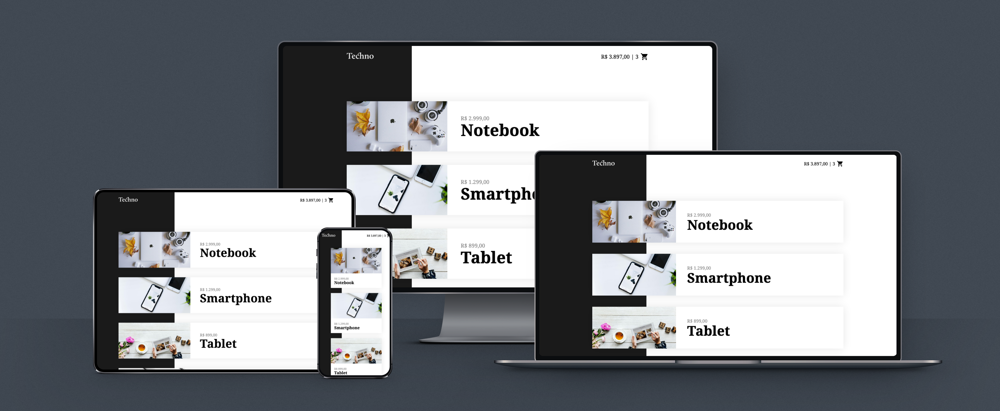

# Techno

Frontend em Vue.js para uma loja de eletrônicos. Desenvolvido durante o curso Vue.js 2 Completo, da [Origamid](https://www.origamid.com/).

**Disclaimer:** O projeto, propositalmente, não possui API funcional e também não está componentizado, tendo como propósito uma demonstração de funções mais básicas do Vue.

---

